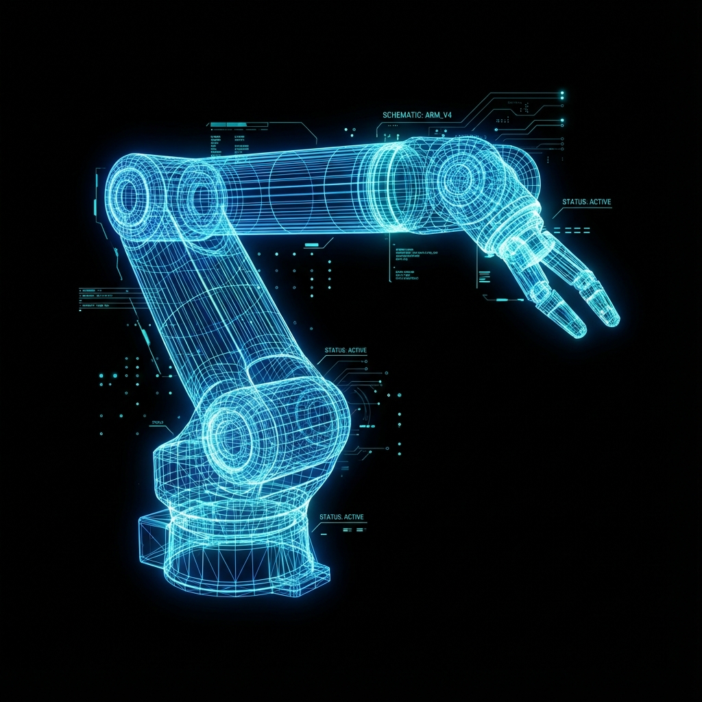

# Robotics & AI Portfolio – Saumya Shah



> **"I Build Intelligent Machines"**

A modern, high-performance portfolio website designed to showcase projects, skills, and research in **Robotics**, **Embedded Systems**, and **Artificial Intelligence**. Built with a focus on minimalism, aesthetics, and user experience.

<div align="center">


</div>

## 🚀 Live Preview
**[View Live Portfolio](https://saumyashah0.github.io/Portfolio/)**  
*(Note: Link will be active once deployed to GitHub Pages)*

---

## ✨ Key Features

- **🌙 Dynamic Dark/Light Mode**: Automatically detects system preference and saves user choice via LocalStorage.
- **🎨 Modern Aesthetics**: Glassmorphism effects, smooth transitions, and a clean, typography-led design (Inter + JetBrains Mono).
- **📱 Fully Responsive**: Optimized for all devices, from large desktop screens to mobile phones.
- **⚡ Performance Focused**: Vanilla JavaScript and CSS for maximum speed and minimal bloat.
- **🤖 Specialized Content**: Tailored specifically for a Robotics Engineer profile.

## 🛠️ Projects

### 1. Vision-Guided Sorting System (UR10e) — M.Tech
*Industrial Robotics, Machine Vision, Coordinate Transformation*
- **Description**: Vision-guided pick-and-place system on a UR10e cobot with camera-to-robot calibration for dynamic sorting.
- **Tech**: UR10e, Machine Vision, Real-time Communication.

### 2. PLC-HMI Automation System — M.Tech
*Industrial Automation, PLC Programming*
- **Description**: Ladder logic and dynamic HMI dashboards for real-time industrial control.
- **Tech**: Allen Bradley, Mitsubishi PLC, Modbus TCP/IP, Ethernet/IP, JMobile.

### 3. BipedalWalker-v3 Locomotion (PPO) — M.Tech
*Reinforcement Learning, Continuous Control*
- **Description**: Continuous-control PPO agent for bipedal locomotion with a full training/reward-visualization pipeline (~40% faster GPU convergence).
- **Tech**: Python, PyTorch, Stable-Baselines3, Gymnasium.

### 4. Autonomous Car Racing (Deep RL) — M.Tech
*Vision-based Reinforcement Learning*
- **Description**: Vision-based RL agent using CNN policies for steering, braking, and acceleration; achieved expert-level performance (reward > 850).
- **Tech**: Python, PyTorch, Stable-Baselines3, TensorBoard.

### 5. Smart Energy Monitoring System (IoT) — M.Tech
*Embedded Systems, Sensor Integration*
- **Description**: Appliance-level monitoring architecture with cloud dashboard for real-time energy visualization.
- **Tech**: IoT sensors, cloud dashboard integration.

### 6. 3DOF Robot Manipulator
*Kinematics, Control Systems, MATLAB*
- **Description**: Designed and built a 3-degree-of-freedom robotic arm capable of precise pick-and-place operations.
- **Tech**: Arduino, MATLAB, Inverse Kinematics algorithms.
- **Highlight**: Implemented custom motion control logic for smooth path planning.

### 7. Autonomous Mobile Robot
*Embedded Systems, Sensors, Navigation*
- **Description**: A differential drive robot engineered for robust line tracking and dynamic obstacle avoidance.
- **Tech**: Arduino, IR Sensors, L298N Motor Driver.
- **Highlight**: Uses threshold-based logic for reliable navigation in varying lighting conditions.

## 💻 Tech Stack

| Category | Technologies |
|----------|--------------|
| **Core** | HTML5, CSS3, JavaScript (ES6+) |
| **Fonts** | Inter (Sans-serif), JetBrains Mono (Monospace) |
| **Icons** | Custom SVG Icons (Feather Icons style) |
| **Tools** | VS Code, Git, GitHub Pages |
| **Robotics & Control** | ROS, Kinematics, Control Systems, Robot Modelling, Reinforcement Learning, Computer Vision |
| **AI & Software** | Python, C/C++, Machine Learning, Deep Learning, Image Processing, Linux |
| **Embedded & Industrial Automation** | Arduino, PLC (Allen Bradley/Mitsubishi), Modbus TCP/IP, Ethernet/IP, HMI Configuration, SCADA |
| **Simulation** | MATLAB, Simulink, PCB Design |

## 📁 Project Structure

```bash
Portfolio/
│── index.html          # Main HTML structure
│── style.css           # Global styles and variables
│── script.js           # Theme toggle logic
│── assets/             # Images and Resume
│     ├── hero-bg.png
│     ├── project1.png
│     ├── project2.png
│     └── SAUMYA_Resume.pdf
└── README.md           # You are here
```

## 📦 Installation & Setup

1. **Clone the repository**
   ```bash
   git clone https://github.com/SaumyaShah0/Portfolio.git
   ```

2. **Navigate to the project directory**
   ```bash
   cd Portfolio
   ```

3. **Open `index.html`** in your browser to view the site locally.
   - Tip: Use VS Code's "Live Server" extension for the best development experience.

## 🌐 Deployment

This project is ready for **GitHub Pages**.

1. Push your changes to the `main` branch.
2. Go to **Settings** > **Pages** in your repository.
3. Select **Source**: `Deploy from a branch`.
4. Select **Branch**: `main` / `root`.
5. Save, and your site will be live!

## 📬 Connect

| Channel | Link |
|---------|------|
| **Email** | [saumyashah630@gmail.com](mailto:saumyashah630@gmail.com) |
| **GitHub** | [SaumyaShah0](https://github.com/SaumyaShah0) |
| **LinkedIn** | [Saumya Shah](https://www.linkedin.com/in/saumya-shah-40a4ba285/) |

---

<p align="center">
  © 2025 Saumya Shah. Built with code and <span style="color:red">❤</span>
</p>
